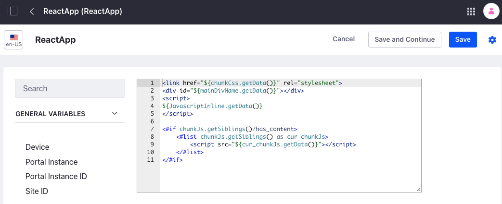

# Liferay DXP with External React Applications

This is a PoC that demonstrates one approach to embed external react applications inside Liferay, without an iframe.

## Setup

Execute docker-compose building all services:

```
docker compose up --build -d
```

Access http://localhost/web/guest/react-apps

See the magic:


---


---

## How it works

The react-simple-example and react-weather-app are ReactJs applications running on Docker containers. They are been proxied by Nginx under the contexts /react-simple-example and /react-weather-app respectively. So, each request to one of these contexts will be treated by the appropriate container.

So far, so good. Then we have to get a Web Content Structure just like the React App index.html, as following:


And also a template that builds the view for that structure:



With that, we can create native Liferay web contents using the structure and template to reference the javascript code, files and css just like its built by the React applications:


So you can drop this web content in any Liferay page, the reverse proxy to the React containers will guarantee that it will load from these containers, as follows:


---


---

## Notes

As may you have noticed, the react application is embedded into the Liferay pages, so be aware that the js functions and libs, also css rules that comes from your application will afect the page at all. Also with routes and DOM tree manipulation.